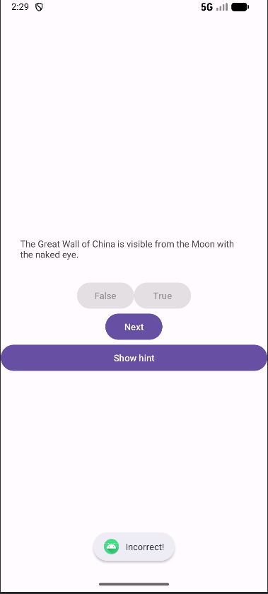

# QuizMaster-Android

QuizMaster is a simple yet engaging quiz application for Android, built entirely in Kotlin. This project is an extended and improved version of a programming assignment for the Mobile Systems course. It challenges users with a series of true or false questions, tracks their score, and even offers a "cheat" option for tricky questions.

This project serves as a great practical example for learning fundamental Android development concepts, including Activity lifecycle, state management with `ViewModel`, and communication between different app screens.



## ✨ Features

- **True/False Questions**: A classic and easy-to-understand quiz format.
- **Score Tracking**: The app calculates and displays the user's score in real-time.
- **Question Navigation**: Users can seamlessly move to the next or previous question.
- **Hint System**: If a user is stuck, they can reveal the correct answer on a separate screen.
- **State Preservation**: The app gracefully handles configuration changes (like screen rotation) without losing the user's progress, thanks to `ViewModel`.

## 🛠️ Technologies & Concepts Demonstrated

- **Language**: **Kotlin**
- **Architecture**: A basic **MVVM (Model-View-ViewModel)** pattern to separate business logic from the UI.
- **Android Jetpack**:
    - `ViewModel`: For managing UI-related data in a lifecycle-conscious way.
- **Core Android Components**:
    - `Activity` and its lifecycle.
    - `Intent` for launching new activities and passing data.
    - `XML`-based layouts for UI design.
    - `Button`, `TextView`, `ImageButton` for user interaction.
    - `Toast` notifications for quick user feedback.

## 🚀 How to Build and Run

To get this project running on your local machine, follow these steps:

1.  **Clone the repository**
```bash
git clone https://github.com/uxabix/QuizMaster-Android.git 
```
2.  **Open the project in Android Studio**
3.  **Run the app on an emulator or physical device**


## 🎯 Future Improvements
This project has a solid foundation that can be extended with new features:
- [ ] Add more question types (e.g., multiple-choice).
- [ ] Implement a timer to challenge the user.
- [ ] Fetch questions from a remote API instead of a hardcoded list.
- [ ] Add a final results screen with a performance summary.
- [ ] Improve UI/UX with animations and a more polished design.

## 📄 License
This project is licensed under the MIT License. See the [LICENSE](LICENSE) file for details.
